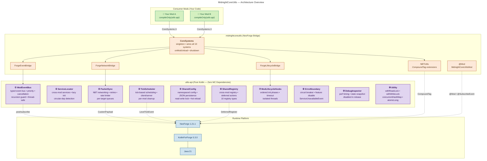

# MidnightCoreUtils — Multi-Mod Sync Core

A **Kotlin-first** utility and inter-mod communication framework for NeoForge 1.21.1. Provides 10 integrated systems that let your mods share data, schedule work, fail gracefully, and sync state — all without hard dependencies at compile time.



---

## Table of Contents

- [What It Is & Why](#what-it-is--why)
- [Quick Start](#quick-start)
- [Module Architecture](#module-architecture)
- [Adding as a Dependency](#adding-as-a-dependency)
- [System Reference](#system-reference)
  - [1. ModEventBus — Typed Event Bus](#1-modeventbus--typed-event-bus)
  - [2. ServiceLocator — Mod Interop Services](#2-servicelocator--mod-interop-services)
  - [3. TickScheduler — Game Tick Scheduling](#3-tickscheduler--game-tick-scheduling)
  - [4. PacketSync — NBT-Based Networking](#4-packetsync--nbt-based-networking)
  - [5. SharedConfig — Cross-Mod Configuration](#5-sharedconfig--cross-mod-configuration)
  - [6. SharedRegistry — Cross-Mod Registry Queries](#6-sharedregistry--cross-mod-registry-queries)
  - [7. ModLifecycleHooks — Ordered Init Lifecycle](#7-modlifecyclehooks--ordered-init-lifecycle)
  - [8. ErrorBoundary — Crash Isolation (Circuit Breaker)](#8-errorboundary--crash-isolation)
  - [9. DebugInspector — Runtime Diagnostics](#9-debuginspector--runtime-diagnostics)
  - [10. Utility — Thread-Safety Helpers](#10-utility--thread-safety-helpers)
- [Bridge Module (midnightcoreutils)](#bridge-module-midnightcoreutils)
  - [CoreSystems](#coresystems)
  - [NBTUtils — CompoundTag Extensions](#nbtutils--compoundtag-extensions)
  - [ForgeEventBridge / ForgeNetworkBridge / ForgeLifecycleBridge](#forge-bridge-adapters)
- [Thread Safety Guarantees](#thread-safety-guarantees)
- [Example: Building a Mod That Uses MidnightCoreUtils](#example-building-a-mod-that-uses-midnightcoreutils)
- [Building & Testing](#building--testing)
- [License](#license)

---

## What It Is & Why

**Problem:** In a multi-mod ecosystem, mods often need to talk to each other — share config, exchange events, query registries, schedule cross-mod tasks, or gracefully degrade when a dependency is missing. This usually leads to `@Optional` annotations, `instanceof` chains, and fragile `@ObjectHolder` references.

**Solution:** MidnightCoreUtils decouples the API from the mod. It provides 10 battle-tested systems in a **zero-Minecraft-dependency** API module (`utils-api`) that your mod can compile against. At runtime, the bridge module (`midnightcoreutils`) wires everything to NeoForge. Every system is designed to be **thread-safe**, **isolated per-mod**, and **fail-graceful**.

### When to Use This

- Your mods need to **share runtime services** with each other (e.g., a currency mod exposing a wallet API).
- You want a **clean event bus** with priorities, cancellation, and propagation stopping — separate from Forge's bus.
- You need **per-mod configuration** that's stored as JSON and survives hot-reload.
- You need to **schedule tick-based tasks** that auto-cancel when a mod unloads.
- You need NBT-based **networking with retries and rate limiting**.
- You want **circuit-breaker isolation** so one broken mod doesn't crash your entire server.

---

## Quick Start

**Step 1:** Add MidnightCoreUtils to your development environment (see [Adding as a Dependency](#adding-as-a-dependency)).

**Step 2:** Access the systems through `CoreSystems` (at runtime):

```kotlin
// In your @Mod class
CoreSystems.tickScheduler.schedule("mymod", { println("5 ticks later") }, 5)
CoreSystems.eventBridge.post(MyCustomEvent())
```

**Step 3:** Optionally, compile against `utils-api` alone for platform-agnostic unit testing:

```kotlin
// build.gradle.kts
dependencies {
    compileOnly(project(":utils-api")) // or from Maven
    testImplementation(project(":utils-api"))
}
```

---

## Module Architecture

| Module | Path | Depends On | Description |
|--------|------|-----------|-------------|
| `utils-api` | `utils-api/` | Nothing (pure Kotlin + stdlib) | All 10 systems, interfaces, data classes. No Minecraft imports. **You can write unit tests without Forge.** |
| `midnightcoreutils` | `midnightcoreutils/` | `utils-api`, NeoForge, KotlinForForge | Mod entry point, `CoreSystems` facade, bridge adapters, `NBTUtils` extension functions. Thin — most logic lives in `utils-api`. |

### Why Two Modules?

1. **Testability** — `utils-api`'s 60+ unit tests run with plain JUnit 5 + MockK in seconds. No Forge bootstrap needed.
2. **Dependency isolation** — Consuming mods can depend on `utils-api` at compile time without pulling in NeoForge or Minecraft. This avoids classpath conflicts.
3. **Platform portability** — The API module could adapt to Fabric or other loaders with a different bridge. The core systems don't change.

---

## Adding as a Dependency

### For Your Mod's `build.gradle`

**If consuming mod has MidnightCoreUtils in the same Gradle project (multi-project):**

```kotlin
dependencies {
    implementation(project(":utils-api"))
    // For the runtime mod jar, add the bridge:
    runtimeOnly(project(":midnightcoreutils"))
}
```

**If consuming from a published Maven repo:**

```kotlin
repositories {
    maven { url = uri("https://your-maven-repo.example.com") }
}

dependencies {
    compileOnly("net.notpumpkins:utils-api:1.0")
    runtimeOnly("net.notpumpkins:midnightcoreutils:1.0")
}
```

> **Recommendation:** Use `compileOnly` for `utils-api` if your mod only uses the API at development time (for `CoreSystems` access). Use `implementation` if you subclass or hold references to API types that must be present at runtime even if MidnightCoreUtils is absent.

### For Testing

```kotlin
dependencies {
    testImplementation("org.junit.jupiter:junit-jupiter:5.11.0")
    testImplementation("io.mockk:mockk:1.13.12")
    testImplementation("org.jetbrains.kotlinx:kotlinx-coroutines-test:1.8.1")
    testImplementation(kotlin("test"))
    testImplementation(project(":utils-api"))
}
```

**Test config (`build.gradle.kts`):**
```kotlin
tasks.test {
    useJUnitPlatform()
    testLogging {
        events("passed", "skipped", "failed")
        exceptionFormat = TestExceptionFormat.FULL
    }
}
```

---

## System Reference

---

### 1. ModEventBus — Typed Event Bus

**Package:** `net.notpumpkins.midnightcoreutils.api.event`

A lightweight, typed event bus separate from NeoForge's event bus. Supports priorities, cancellation, propagation stopping, recursion-depth guarding, and per-owner bulk unsubscribe.

#### Creating an Event

```kotlin
class MyEvent(val message: String) : ModEvent()

// Cancellable events implement CancellableModEvent:
class InteractEvent(val player: UUID) : ModEvent(), CancellableModEvent
```

#### Subscribing

```kotlin
// Via CoreSystems at runtime:
val sub = CoreSystems.eventBridge.subscribe(
    eventClass = MyEvent::class.java,
    priority = EventPriority.HIGH,
    owner = "mymod",
    listener = { event -> println("Got: ${event.message}") }
)

// Later, unsubscribe:
sub.unsubscribe()
// Or bulk:
CoreSystems.eventBridge.unsubscribeAll("mymod")
```

#### Posting

```kotlin
val result = CoreSystems.eventBridge.post(MyEvent("hello"))
println("Cancelled: ${result.isCancelled}")
```

#### Priority Order (Lowest → Highest)

| Priority | Value |
|----------|-------|
| `LOWEST` | 0 |
| `LOW` | 1 |
| `NORMAL` | 2 |
| `HIGH` | 3 |
| `HIGHEST` | 4 |

Higher-priority listeners run first. A listener can call `event.stopPropagation()` to prevent any lower-priority listener from seeing the event.

#### Recursion Guard

If an event handler posts another event that eventually leads back to the first event type, the bus detects the cycle after **64 levels** and throws `StackOverflowError`. This prevents infinite loops.

#### Direct API Access (if you use `utils-api` directly)

```kotlin
val bus = ModEventBus()
bus.subscribe(MyEvent::class.java, owner = "test") { println("got it") }
bus.post(MyEvent("hi"))
```

---

### 2. ServiceLocator — Mod Interop Services

**Package:** `net.notpumpkins.midnightcoreutils.api.service`

A service locator pattern for mods to expose functionality to each other without hard inter-mod dependencies. Supports eager registration and lazy initialization with circular-dependency detection.

#### Registering a Service

```kotlin
// Eager:
CoreSystems.serviceLocator.registerService(
    modId = "mymod",
    serviceClass = MyApi::class.java,
    service = MyApiImpl()
)

// Lazy (factory called once on first getService):
CoreSystems.serviceLocator.registerLazyService(
    modId = "mymod",
    serviceClass = MyApi::class.java,
    factory = { MyApiImpl() }
)
```

#### Getting a Service (from another mod)

```kotlin
val api = CoreSystems.serviceLocator.getService("mymod", MyApi::class.java)
api.doSomething()
```

#### Error Handling

- `IllegalArgumentException` — Duplicate registration for the same mod+class.
- `IllegalStateException` — Service not found.
- `CircularDependencyException` — Mod A resolves Mod B's service which resolves Mod A's service in the same thread.

#### Thread Safety

Services are stored in `ConcurrentHashMap` and all read/write operations are guarded by `ReentrantReadWriteLock`. Lazy promotion (factory → eager instance) acquires a write lock after releasing the read lock, which is safe because the read-lock code path has already verified the factory exists. The circular-dependency detector uses a `ThreadLocal` set, so concurrent resolutions on different threads don't conflict.

---

### 3. TickScheduler — Game Tick Scheduling

**Package:** `net.notpumpkins.midnightcoreutils.api.scheduler`

Schedule one-shot and repeating tasks that fire after a configurable number of game ticks. Tasks are isolated per mod owner and distinguished by client/server tick phase.

#### Scheduling

```kotlin
// One-shot: fire after 20 ticks (1 second at 20 TPS)
CoreSystems.tickScheduler.schedule(
    owner = "mymod",
    action = { println("20 ticks elapsed!") },
    delayTicks = 20,
    phase = TickPhase.SERVER
)

// Repeating: fire every 10 ticks, starting after 5 ticks
CoreSystems.tickScheduler.scheduleRepeating(
    owner = "mymod",
    action = { println("tick!") },
    intervalTicks = 10,
    delayTicks = 5,
    phase = TickPhase.CLIENT
)
```

#### Cancellation

```kotlin
// Cancel a specific task by ID:
val taskId = CoreSystems.tickScheduler.schedule("mymod", { ... }, 20)
CoreSystems.tickScheduler.cancel(taskId)

// Cancel all tasks for a mod:
CoreSystems.tickScheduler.cancelAll("mymod")
```

#### Mod Unload Safety

When a mod unloads, `CoreSystems.onModUnload("mymod")` is called, which calls `tickScheduler.onModUnload("mymod")` — automatically cancelling all pending tasks for that mod.

#### Tick Phase Separation

- `TickPhase.SERVER` tasks only fire during server ticks (via `CoreSystems.onServerTick()`).
- `TickPhase.CLIENT` tasks only fire during client ticks (via `CoreSystems.onClientTick()`).
- A task's phase is set at creation and cannot be changed.

#### Thread Safety

Each tick phase has its own `ConcurrentLinkedQueue`. Iteration takes a snapshot via `toTypedArray()` so tasks can be added/removed during the tick without `ConcurrentModificationException`. Cancellation is cooperative: a cancelled task's `AtomicBoolean` is set to `true`, and the tick loop skips it.

---

### 4. PacketSync — NBT-Based Networking

**Package:** `net.notpumpkins.midnightcoreutils.api.network`

Abstract NBT-based networking with per-target queuing, retries, and a sliding-window rate limiter. Platform-agnostic — the API defines `NbtPayload` instead of using Minecraft's `CompoundTag` directly.

#### NbtPayload (Abstract Data Layer)

```kotlin
interface NbtPayload {
    fun hasKey(key: String): Boolean
    fun getString(key: String): String?
    fun putString(key: String, value: String)
    fun getInt(key: String): Int?
    fun putInt(key: String, value: Int)
    fun getLong(key: String): Long?
    // ... getDouble, getBoolean, getByteArray, getCompound
    fun getAllKeys(): Set<String>
    fun copy(): NbtPayload
    fun isEmpty(): Boolean
    fun size(): Int
}
```

`SimpleNbtPayload` is the default implementation — backed by `ConcurrentHashMap`. Byte arrays are limited to **512 KB** by default (configurable via constructor).

#### Sending

```kotlin
// Set up a send handler (you provide the actual network transport):
CoreSystems.networkBridge.getPacketSync().setSendHandler { payload, target, isServerBound ->
    // Convert to CompoundTag via networkBridge.nbtToCompound(payload)
    // Send via your network channel
    true // return true on success
}

// Enqueue:
val payload = SimpleNbtPayload()
payload.putString("command", "sync_inventory")
payload.putInt("slot", 4)
CoreSystems.networkBridge.getPacketSync().sendToServer(payload, "targetmod")
CoreSystems.networkBridge.getPacketSync().sendToClient(payload, "targetmod", "player_uuid")
```

#### Receiving

```kotlin
CoreSystems.networkBridge.getPacketSync().setReceiveHandler { payload, sourceModId, isServerBound ->
    val cmd = payload.getString("command")
    when (cmd) {
        "sync_inventory" -> handleSync(payload)
    }
}
```

#### Processing Outgoing

Outgoing packets are automatically processed by `CoreSystems.onServerTick()`, which calls `processOutgoing()` every server tick.

#### Rate Limiting

| Parameter | Default | Description |
|-----------|---------|-------------|
| `maxBurst` | 100 | Max packets per time window |
| `windowMs` | 1000 | Sliding window in ms |
| `maxQueueDepth` | 500 | Max queued packets per target |

When the rate limit is hit, `enqueue()` returns `false` and the packet is dropped.

#### Platform Bridge

`ForgeNetworkBridge` converts between `NbtPayload` and NeoForge's `CompoundTag`:

```kotlin
val tag = CoreSystems.networkBridge.nbtToCompound(payload)
val payload = CoreSystems.networkBridge.compoundToNbt(tag)
```

---

### 5. SharedConfig — Cross-Mod Configuration

**Package:** `net.notpumpkins.midnightcoreutils.api.config`

Type-safe, namespaced configuration system with JSON persistence. Each mod gets its own namespace; values are `ConfigValue<T>` objects that can be read/written.

#### Registering & Using Config Values

```kotlin
val greeting = CoreSystems.sharedConfig.registerValue(
    modId = "mymod",
    key = "greeting",
    defaultValue = "Hello"
)

// Read:
val text = greeting.get()   // "Hello"
// Or:
val text = CoreSystems.sharedConfig.get("mymod", "greeting", "Default")

// Write:
greeting.set("Hi there")
// Or:
CoreSystems.sharedConfig.set("mymod", "greeting", "Hi there")

// Reset to default:
greeting.reset()
```

#### File Persistence

```kotlin
val configPath = Path.of("config/mymod.json")

// Load:
CoreSystems.sharedConfig.loadFromFile(configPath)

// Save:
CoreSystems.sharedConfig.saveToFile(configPath)

// Save is atomic — writes to a .tmp file first, then renames.
```

#### JSON Format

```json
{
  "mymod": {
    "greeting": "Hi there",
    "volume": 0.8,
    "enabled": true
  },
  "anothermod": {
    "color": "red"
  }
}
```

The built-in `JsonConfigSerializer` uses a custom hand-written parser (no Gson/Jackson dependency) and handles strings, numbers (Long/Double), booleans, null, arrays, and nested objects.

#### Hot Reload (Declared, Not Yet Implemented)

`enableHotReload()` and `disableHotReload()` are declared but the background file watcher is not active. This is a planned feature — contributions welcome.

#### Thread Safety

All operations guarded by `ReentrantReadWriteLock`. Internal storage is `ConcurrentHashMap<String, ConcurrentHashMap<String, ConfigValue<*>>>`.

---

### 6. SharedRegistry — Cross-Mod Registry Queries

**Package:** `net.notpumpkins.midnightcoreutils.api.registry`

A centralized registry that lets mods register and query items, blocks, entities, and other `RegistryType` entries across mod boundaries.

#### Registry Types

```kotlin
enum class RegistryType(val registryName: String) {
    ITEM, BLOCK, ENTITY, BLOCK_ENTITY, MENU,
    RECIPE_SERIALIZER, SOUND_EVENT, POTION, ENCHANTMENT, PARTICLE
}
```

#### Registering

```kotlin
CoreSystems.sharedRegistry.register(
    modId = "mymod",
    name = "my_item",
    type = RegistryType.ITEM,
    supplier = { MyItem() }   // deferred — called on first access
)
```

#### Querying

```kotlin
// Get all items registered by a specific mod:
val myItems = CoreSystems.sharedRegistry.query<Item>("mymod", RegistryType.ITEM)

// Get a specific entry:
val entry = CoreSystems.sharedRegistry.get<Item>(
    RegistryKey("mymod", "my_item", RegistryType.ITEM)
)
val item = entry?.objectReference  // triggers supplier

// Get all items of a type regardless of mod:
val allItems = CoreSystems.sharedRegistry.getAllOfType<Item>(RegistryType.ITEM)
```

#### Deferred Actions

```kotlin
CoreSystems.sharedRegistry.addDeferredAction("mymod") {
    // Runs when the mod signals it's ready
}
CoreSystems.sharedRegistry.runDeferredActions("mymod")
```

#### Mod Removal

```kotlin
CoreSystems.sharedRegistry.removeMod("mymod")  // removes all entries
```

#### Thread Safety

All operations use `ReentrantReadWriteLock`. Queries acquire a read lock; registration and removal acquire a write lock.

---

### 7. ModLifecycleHooks — Ordered Init Lifecycle

**Package:** `net.notpumpkins.midnightcoreutils.api.lifecycle`

A per-mod lifecycle system with three phases (`PRE_INIT`, `INIT`, `POST_INIT`), each with a configurable timeout. Hooks run in isolated threads so one hung mod doesn't block the entire startup.

#### Registering Hooks

```kotlin
CoreSystems.lifecycleHooks.registerHook(
    modId = "mymod",
    phase = LifecyclePhase.INIT,
    order = 10,           // lower runs first
    action = { loadDatabase() }
)

CoreSystems.lifecycleHooks.registerShutdownHook(
    modId = "mymod",
    action = { saveAndClose() }
)
```

#### Execution Order

1. All hooks sorted by `order` (ascending), then by `modId` (alphabetical).
2. Within each phase, hooks run sequentially. Each hook gets its own `Thread` with a `join(timeout)`.
3. On timeout, the thread is interrupted, and the hook is logged as `TIMEOUT`.
4. Shutdown hooks run in reverse registration order.

#### Monitoring

```kotlin
val logs = CoreSystems.lifecycleHooks.getLogs()
// List of LifecycleLogEntry(modId, phase, status, timestamp, durationMs)

val done = CoreSystems.lifecycleHooks.hasCompleted("mymod", LifecyclePhase.INIT)
val timedOut = CoreSystems.lifecycleHooks.hasTimedOut("mymod", LifecyclePhase.INIT)
```

#### Thread Safety

All storage uses `ConcurrentHashMap` and `ConcurrentLinkedQueue`. No explicit locking needed.

---

### 8. ErrorBoundary — Crash Isolation

**Package:** `net.notpumpkins.midnightcoreutils.api.error`

A circuit-breaker pattern for mod features. When a feature crashes, it is automatically disabled, a `ServiceUnavailableEvent` is posted, and the error is logged. The next call to that feature returns `null` without executing.

#### Usage

```kotlin
val result = CoreSystems.errorBoundary.execute("mymod", "database_query") {
    db.query()
}
// result is null if the query threw, or the query result

// If you want the exception to propagate:
try {
    CoreSystems.errorBoundary.executeOrThrow("mymod", "critical_op") {
        criticalCode()
    }
} catch (e: Exception) {
    // handle
}
```

#### Re-enabling a Feature

```kotlin
CoreSystems.errorBoundary.reenableFeature("mymod", "database_query")
```

#### Monitoring

```kotlin
val errors = CoreSystems.errorBoundary.getErrors("mymod")
val all = CoreSystems.errorBoundary.getAllErrors()
```

#### Thread Safety

Uses `ConcurrentHashMap` for error storage and feature states. `AtomicBoolean` for global shutdown. Safe for concurrent calls.

---

### 9. DebugInspector — Runtime Diagnostics

**Package:** `net.notpumpkins.midnightcoreutils.api.debug`

Performance timing and system state snapshot generation. **Disabled by default** in release builds (`CoreSystems` creates it with `enabled = false`).

#### Timing

```kotlin
if (debugInspector.isEnabled()) {
    val result = debugInspector.time("MySystem", "myOperation") {
        doExpensiveWork()
    }
} else {
    // No overhead when disabled
}
```

#### Snapshot

```kotlin
val snapshot = debugInspector.dumpSnapshot()
// Returns a human-readable string with:
// - ModEventBus: active listener count
// - ServiceLocator: registered mods
// - TickScheduler: pending tasks
// - PacketSync: queue depth, sent, failures
// - SharedRegistry: entry counts by type
// - ModLifecycleHooks: log entry count
// - ErrorBoundary: total errors
// - SharedConfig: registered namespaces
// - Performance averages by system
```

#### Thread Safety

Performance samples stored in `ConcurrentHashMap` with `synchronized` blocks on individual sample lists.

---

### 10. Utility — Thread-Safety Helpers

**Package:** `net.notpumpkins.midnightcoreutils.api.util`

Small inline helpers to reduce boilerplate.

```kotlin
import net.notpumpkins.midnightcoreutils.api.util.*

// Read/Write lock helpers:
val lock = ReentrantReadWriteLock()
lock.withReadLock { readData() }
lock.withWriteLock { writeData() }

// Factory functions:
val map = concurrentHashMap<String, Int>()       // ConcurrentHashMap
val list = concurrentList<String>()               // CopyOnWriteArrayList
val counter = atomicLong(42L)                     // AtomicLong
```

---

## Bridge Module (midnightcoreutils)

### CoreSystems

**Package:** `net.notpumpkins.midnightcoreutils.bridge`

A singleton `object` that creates, wires, and exposes all 10 systems. This is your primary entry point at runtime.

```kotlin
object CoreSystems {
    val eventBridge: ForgeEventBridge              // wraps ModEventBus
    val serviceLocator: ServiceLocator
    val tickScheduler: TickScheduler
    val networkBridge: ForgeNetworkBridge          // wraps PacketSync + NBT conversion
    val sharedConfig: SharedConfig
    val sharedRegistry: SharedRegistry
    val lifecycleHooks: ModLifecycleHooks
    val errorBoundary: ErrorBoundary
    val debugInspector: DebugInspector             // disabled by default

    fun initialize()                               // called in @Mod init
    fun onServerTick()                             // tick scheduler + process outgoing packets
    fun onClientTick()                             // tick scheduler only
    fun onModUnload(modId: String)                 // clean up all systems for a mod
    fun shutdown()                                 // full system shutdown
}
```

**Mod unload flow (`onModUnload`):**

```
eventBridge.unsubscribeAll(modId)
serviceLocator.removeServices(modId)
tickScheduler.onModUnload(modId)
sharedRegistry.removeMod(modId)
sharedConfig.removeNamespace(modId)
lifecycleHooks.removeHooks(modId)
errorBoundary.clearMod(modId)
```

### NBTUtils — CompoundTag Extensions

**Package:** `net.notpumpkins.midnightcoreutils.bridge`

Direct extension functions on Minecraft's `CompoundTag` for maximum performance (no abstraction overhead).

| Function | Description |
|----------|-------------|
| `putEnum(key, value)` | Stores any `Enum` as its name string |
| `getEnum<T>(key)` | Reads it back — null-safe if value missing |
| `putUUID(key, uuid)` | Two `Long`s (`key_most`, `key_least`) |
| `getUUID(key)` | Reads UUID, or `null` |
| `putVec3(key, vec)` | Nested compound with `x`/`y`/`z` doubles |
| `getVec3(key)` | Reads Vec3, or `null` |
| `putBlockPos(key, pos)` | Nested compound with `x`/`y`/`z` ints |
| `getBlockPos(key)` | Reads BlockPos, or `null` |
| `getSafeString(key)` | Type-safe read (returns `null` if wrong tag type) |
| `getSafeInt(key)` | Type-safe read |
| `getSafeLong(key)` | Type-safe read |
| `getSafeDouble(key)` | Type-safe read |
| `getSafeBoolean(key)` | Type-safe read |
| `deepMerge(source)` | Returns a new tag with all keys from source merged recursively |
| `deepMergeInPlace(source)` | Mutates self by merging source recursively |
| `diff(other)` | Returns `Set<String>` of changed/added/removed keys (dotted path) |
| `toReadableString(indent)` | Pretty-printed JSON-like output |

### Forge Bridge Adapters

| Adapter | Role |
|---------|------|
| `ForgeEventBridge` | Wraps `ModEventBus` — provides typed `subscribe`/`post`/`unsubscribeAll`/`clear` |
| `ForgeLifecycleBridge` | Maps NeoForge `FMLCommonSetupEvent` → `PRE_INIT`+`INIT`, `FMLClientSetupEvent`/`FMLDedicatedServerSetupEvent` → `POST_INIT`, and registers shutdown hooks |
| `ForgeNetworkBridge` | Holds a `PacketSync` instance and provides `nbtToCompound()` / `compoundToNbt()` conversion |

---

## Thread Safety Guarantees

| System | Mechanism | Concurrent Read | Concurrent Write |
|--------|-----------|:---:|:---:|
| ModEventBus | `CopyOnWriteArrayList` + `ConcurrentHashMap` + `ThreadLocal` | ✓ | ✓ (snapshot iteration) |
| ServiceLocator | `ReentrantReadWriteLock` + `ConcurrentHashMap` + `ThreadLocal` | ✓ (multiple readers) | ✓ (exclusive write) |
| TickScheduler | `ConcurrentLinkedQueue` + `AtomicBoolean` + snapshot iteration | ✓ | ✓ (cooperative cancel) |
| PacketSync | `ConcurrentHashMap` + `ConcurrentLinkedQueue` + `AtomicInteger` | ✓ | ✓ (per-target queues) |
| SharedConfig | `ReentrantReadWriteLock` + `ConcurrentHashMap` | ✓ (multiple readers) | ✓ (exclusive write) |
| SharedRegistry | `ReentrantReadWriteLock` + `ConcurrentHashMap` | ✓ (multiple readers) | ✓ (exclusive write) |
| ModLifecycleHooks | `ConcurrentHashMap` + `ConcurrentLinkedQueue` + `AtomicBoolean` | ✓ | ✓ |
| ErrorBoundary | `ConcurrentHashMap` + `AtomicBoolean` | ✓ | ✓ |
| DebugInspector | `ConcurrentHashMap` + `synchronized` on lists | ✓ | ✓ (per-list lock) |
| SimpleNbtPayload | `ConcurrentHashMap` | ✓ | ✓ |

**Key design choice:** Systems that benefit from read concurrency (config, registry, service locator) use `ReentrantReadWriteLock`. Systems that are naturally concurrent (event bus with snapshot iteration, tick scheduler) use lock-free concurrent collections.

---

## Example: Building a Mod That Uses MidnightCoreUtils

Here's a complete example of a theoretical "Greeter" mod that uses 5 of the 10 systems.

### `build.gradle.kts`

```kotlin
plugins {
    id("org.jetbrains.kotlin.jvm") version "2.0.0"
    id("net.neoforged.moddev") version "2.0.141"
}

dependencies {
    implementation("net.neoforged:neoforge:21.1.219")
    implementation("thedarkcolour:kotlinforforge-neoforge:5.3.0")
    implementation(project(":midnightcoreutils"))
}

tasks.test {
    useJUnitPlatform()
}
```

### `src/main/kotlin/com/example/greeter/GreeterMod.kt`

```kotlin
@Mod("greeter")
@EventBusSubscriber(modid = "greeter")
object GreeterMod {
    const val ID = "greeter"

    init {
        // 1. Register a custom event
        CoreSystems.eventBridge.subscribe(
            HelloEvent::class.java,
            priority = EventPriority.NORMAL,
            owner = ID
        ) { event ->
            println("${event.name} says hello at tick ${event.tick}")
        }

        // 2. Expose a service for other mods
        CoreSystems.serviceLocator.registerService(ID, GreeterApi::class.java, GreeterApiImpl())

        // 3. Schedule a repeating task
        CoreSystems.tickScheduler.scheduleRepeating(ID, {
            println("Heartbeat tick")
        }, intervalTicks = 20)

        // 4. Register a config value
        val enabled = CoreSystems.sharedConfig.registerValue(ID, "enabled", true)
        if (enabled.get()) {
            CoreSystems.tickScheduler.schedule(ID, { println("Enabled!") }, 1)
        }

        // 5. Register an item
        CoreSystems.sharedRegistry.register(ID, "greeter_wand", RegistryType.ITEM) {
            Item(Item.Properties())
        }
    }
}

class HelloEvent(
    val name: String,
    val tick: Long
) : ModEvent()

interface GreeterApi {
    fun greet(name: String): String
}

class GreeterApiImpl : GreeterApi {
    override fun greet(name: String) = "Hello, $name!"
}
```

### Running Tests

```kotlin
class GreeterApiImplTest {
    @Test
    fun `greet returns correct message`() {
        val api = GreeterApiImpl()
        assertEquals("Hello, World!", api.greet("World"))
    }
}
```

---

## Building & Testing

```bash
# Full build (both modules)
./gradlew build

# Run only API unit tests (fast — no Forge)
./gradlew :utils-api:test

# Run a specific test class
./gradlew :utils-api:test --tests "*ModEventBusTest*"

# Compile the mod module
./gradlew :midnightcoreutils:compileKotlin

# Run client (NeoForge dev)
./gradlew :midnightcoreutils:runClient
```

**Prerequisites:**
- JDK 21 (configured in `gradle.properties` via `org.gradle.java.home`)
- Gradle 8.8 (wrapper included)

**Note on `./gradlew :utils-api:test --no-daemon`:** The full test suite runs 60+ tests. If you observe a ~60-second hang after all tests pass, this is a JVM thread-purge issue in the Gradle test executor, not a test failure. All individual test classes pass in 4–5 seconds each.

---

## License

```
Copyright 2024 SpaceLogic Studios, Pumpkins

Licensed under the Apache License, Version 2.0 (the "License");
you may not use this file except in compliance with the License.
You may obtain a copy of the License at

    http://www.apache.org/licenses/LICENSE-2.0

Unless required by applicable law or agreed to in writing, software
distributed under the License is distributed on an "AS IS" BASIS,
WITHOUT WARRANTIES OR CONDITIONS OF ANY KIND, either express or implied.
See the License for the specific language governing permissions and
limitations under the License.
```

## Contributing

Contributions, issues, and feature requests are welcome. See [CONTRIBUTING.md](CONTRIBUTING.md) for guidelines.
